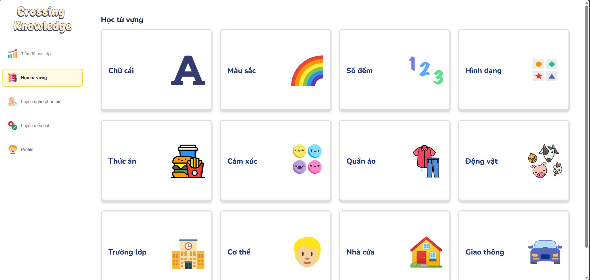
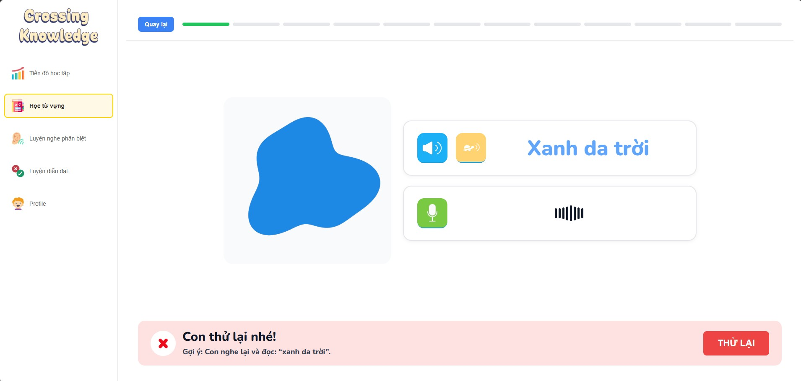
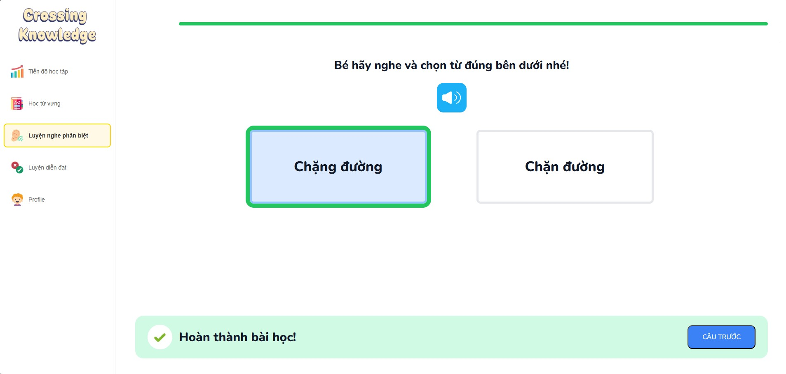
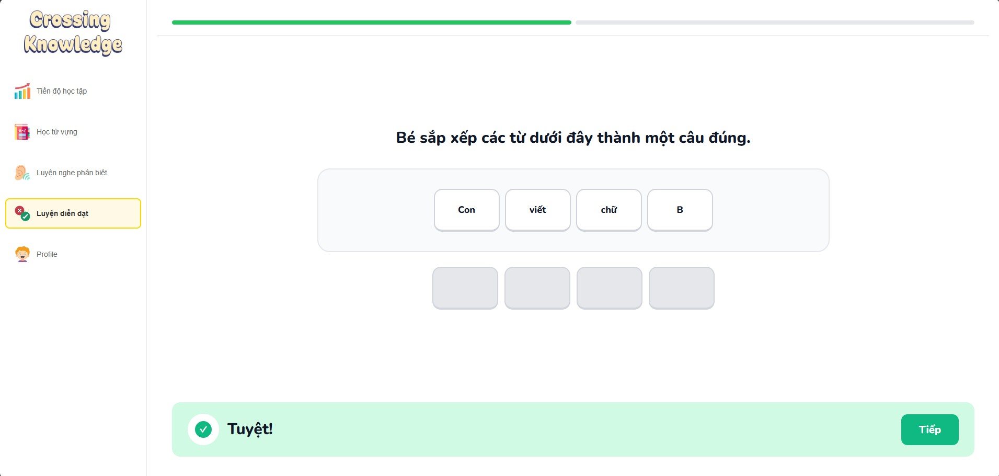
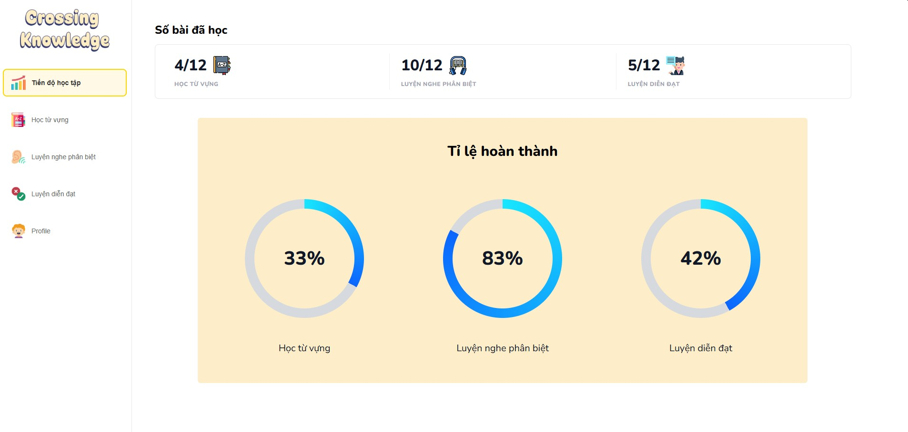
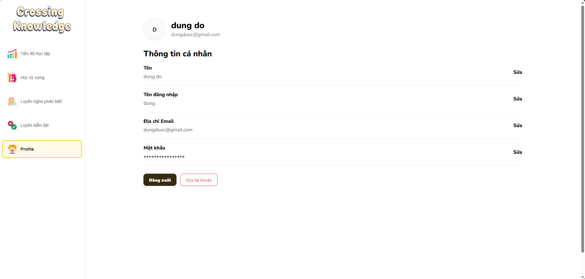

# Crossing Knowledge

Trang web học tập ngôn ngữ cho trẻ.

## 1. Giới thiệu tổng quan

Ứng dụng **Crossing Knowledge** được phát triển theo định hướng trực quan, dễ sử dụng và hỗ trợ luyện tập từng kỹ năng riêng biệt nhằm hỗ trợ trẻ luyện tập ngôn ngữ tiếng Việt thông qua các hoạt động tương tác đơn giản, giúp trẻ:

- học từ vựng qua hình ảnh và âm thanh
- luyện phát âm 
- luyện nghe phân biệt âm
- luyện diễn đạt câu

Ngoài ra, ứng dụng cũng giúp **phụ huynh theo dõi tiến độ học tập của trẻ** một cách trực quan và dễ dàng.

## 2. Công nghệ sử dụng

### Frontend

- React 19
- Vite
- React Router DOM
- Redux Toolkit
- React Redux
- Axios
- Ant Design

### Backend

- NestJS
- TypeScript
- TypeORM
- JSON Web Token

### Database

- PostgreSQL

### Công nghệ Speech recognition

- Web Speech API
- Nhận dạng giọng nói
- So sánh phát âm với mẫu chuẩn
- Đánh giá mức độ chính xác của phát âm

## 3. Chức năng chính

### 3.1. Học từ vựng theo chủ đề

Hệ thống cung cấp 12 bài học từ vựng theo các chủ đề quen thuộc như chữ cái, màu sắc, số đếm, hình dạng, thức ăn, cảm xúc, quần áo, động vật, trường lớp, cơ thể, nhà cửa và giao thông.

Mỗi bài học có thể bao gồm:

- hình ảnh minh họa
- âm thanh mẫu
- phần ghi âm và kiểm tra phát âm

Giao diện:




### 3.2. Luyện phát âm và nhận gợi ý sửa lỗi

Người dùng nghe từ mẫu, đọc lại theo từ và nhận phản hồi đánh giá phát âm. Hệ thống hiện hỗ trợ gợi ý sửa lỗi ở mức cơ bản dựa trên nội dung nhận diện được.

Giao diện:



### 3.3. Luyện nghe phân biệt

Người dùng nghe audio và chọn đáp án đúng giữa các lựa chọn có sẵn. Chức năng này hướng đến việc giúp trẻ phân biệt âm và nhận biết từ đúng.

Giao diện:



### 3.4. Luyện diễn đạt bằng cách sắp xếp câu

Người dùng sắp xếp các từ bị xáo trộn để tạo thành câu đúng. Hệ thống hỗ trợ kiểm tra đáp án, thử lại khi làm sai và chuyển sang câu tiếp theo.

Giao diện:



### 3.5. Theo dõi tiến độ học tập

Ứng dụng hiển thị số bài đã hoàn thành theo từng nhóm chức năng và tỷ lệ hoàn thành tương ứng. Mỗi bài học hoàn thành sẽ được đánh dấu riêng theo tài khoản người dùng.

Giao diện:



### 3.6. Quản lý hồ sơ

Giao diện:



## 4. Cấu trúc thư mục

```text
Crossing-Knowledge
│
├── backend
│   ├── src
│   │   ├── auth
│   │   ├── users
│   │   ├── vocabulary
│   │   ├── pronunciation
│   │   ├── listening-comprehension
│   │   ├── sentence-construction
│   │   ├── progress
│   │   ├── app.module.ts
│   │   └── main.ts
│   │
│   ├── scripts
│   ├── seed
│   ├── test
│   └── package.json
│
├── frontend
│   ├── public
│   ├── src
│   │   ├── apis
│   │   ├── assets
│   │   ├── components
│   │   ├── layouts
│   │   ├── pages
│   │   ├── redux
│   │   ├── mock
│   │   ├── App.jsx
│   │   └── main.jsx
│   │
│   └── package.json
│
├── images
├── package.json
└── README.md
```

## 5. Yêu cầu môi trường

Trước khi chạy dự án, cần chuẩn bị (khuyến nghị):

- Node.js >= 18
- npm >= 9
- Git
- PostgreSQL >= 14

## 6. Hướng dẫn chạy dự án

### Bước 1. Clone dự án

```bash
git clone https://github.com/csDune05/Crossing-Knowledge
cd Crossing-Knowledge
```

### Bước 2. Cài dependencies

Cài cho backend:

```bash
cd backend
npm install
```

Cài cho frontend:

```bash
cd ../frontend
npm install
```

### Bước 3. Chạy backend

1. Tạo database "ttnm" trên PostgreSQL

2. Khởi chạy backend
```bash
cd backend
npm run start:dev
```

Backend mặc định chạy tại:

```text
http://localhost:3000
```

### Bước 4. Chạy frontend

```bash
cd frontend
npm run dev
```

Frontend mặc định chạy tại:

```text
http://localhost:5173
```